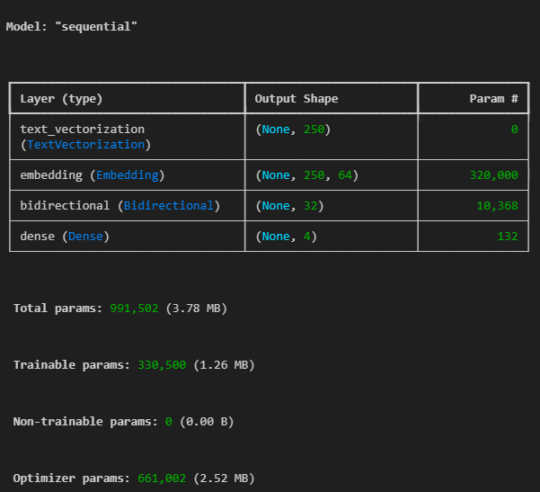
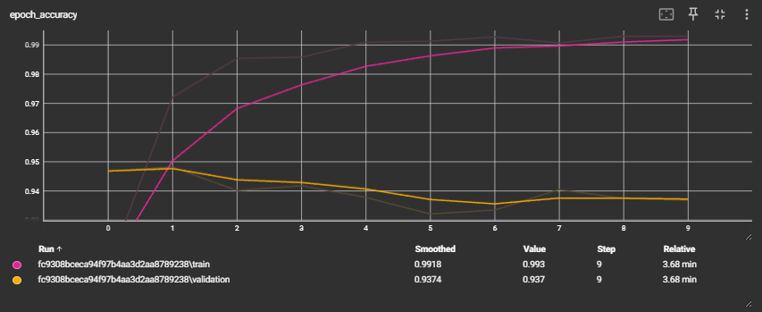
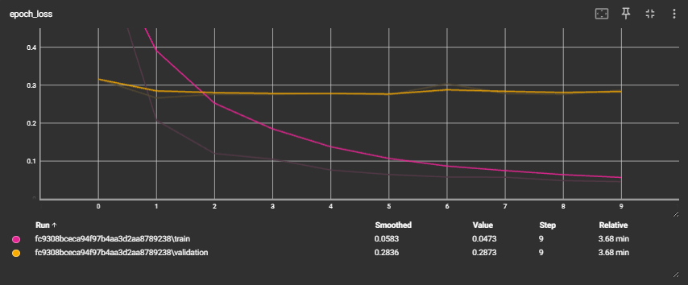
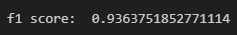

# E-commerce Product Categorization using LSTM

This project focuses on the categorization of e-commerce products into four predefined categories: "Electronics", "Household", "Books", and "Clothing & Accessories". The goal is to use machine learning to automate the categorization process, which is traditionally done manually, to save time and resources. The project uses a Long Short-Term Memory (LSTM) network to classify unseen product data with high accuracy.

## Project Overview

E-commerce platforms generate vast amounts of textual data that contain valuable insights for businesses. By categorizing products into different segments, companies can streamline their operations and focus on specific types of products. However, the manual classification of products is time-consuming, and this project aims to solve this problem using machine learning.

In this project, an LSTM model will be developed to categorize e-commerce products into one of the four categories: 
- Electronics
- Household
- Books
- Clothing & Accessories

The model will be trained using the dataset obtained from Kaggle and evaluated based on its accuracy and F1 score.

## Dataset

The dataset used in this project can be obtained from Kaggle:

- **Dataset URL**: [E-commerce Text Classification Dataset](https://www.kaggle.com/datasets/saurabhshahane/ecommerce-text-classification/data)

The dataset consists of text descriptions of products, which will be used to train the LSTM model for categorization.

## Project Requirements

### 1. Data Processing
- Download the dataset and read it using **Pandas** to preprocess and prepare the data for training.

### 2. Model Development
- Develop a machine learning model using **LSTM** (Long Short-Term Memory) to classify products into the specified categories.
- Achieve an accuracy of more than **85%** and an **F1 score of more than 0.7**.

### 3. TensorFlow
- Use the **TensorFlow** library for developing and training the model.

### 4. TensorBoard
- Visualize the training process using **TensorBoard**.

### 5. Model & Tokenizer Saving
- Save the trained model in **.keras** format in a folder named **saved_models**.
- Save the tokenizer in **.pkl** format in the **saved_models** folder.

### 6. Performance Evaluation
- The model’s performance should be evaluated using accuracy and F1 score metrics.

### Folder Structure
- **saved_models/**: Folder containing the model in **.keras** format and tokenizer in **.pkl** format.
- **images/**: Folder containing all images (e.g., model architecture, performance metrics, TensorBoard graphs).
- **dataset/**: Folder containing the dataset.

- **Dataset Source**: [E-commerce Text Classification Dataset on Kaggle](https://www.kaggle.com/datasets/saurabhshahane/ecommerce-text-classification/data)

## Model Architecture

Below is the architecture of the LSTM model used in this project.

## Results

### Tensorboard Screenshot

Here is a graph between the accuracy training vs validation score:

Here is a graph between the loss training vs validation score:

Here is the model f1 score:

Here is the model accuracy score:

